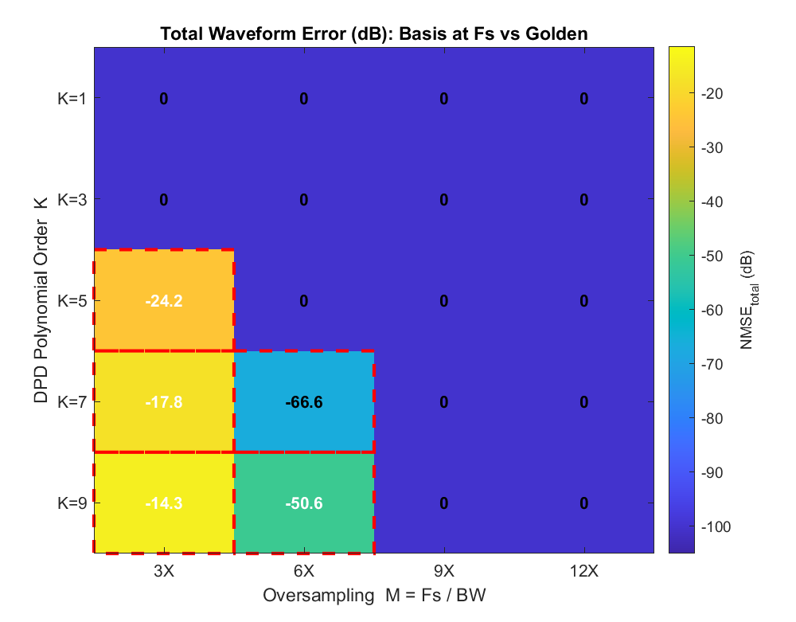
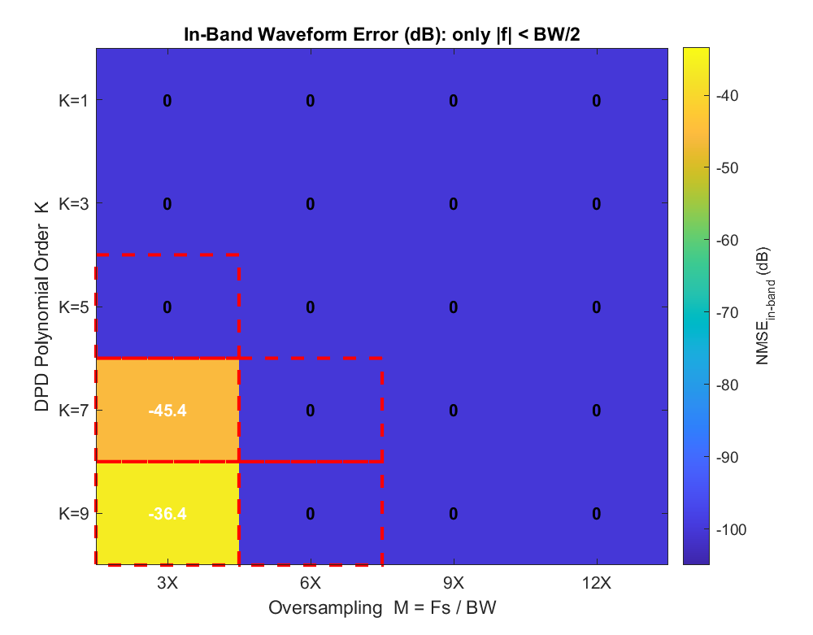
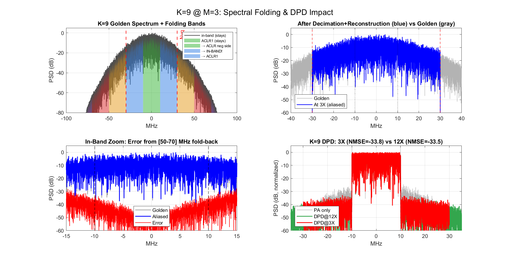
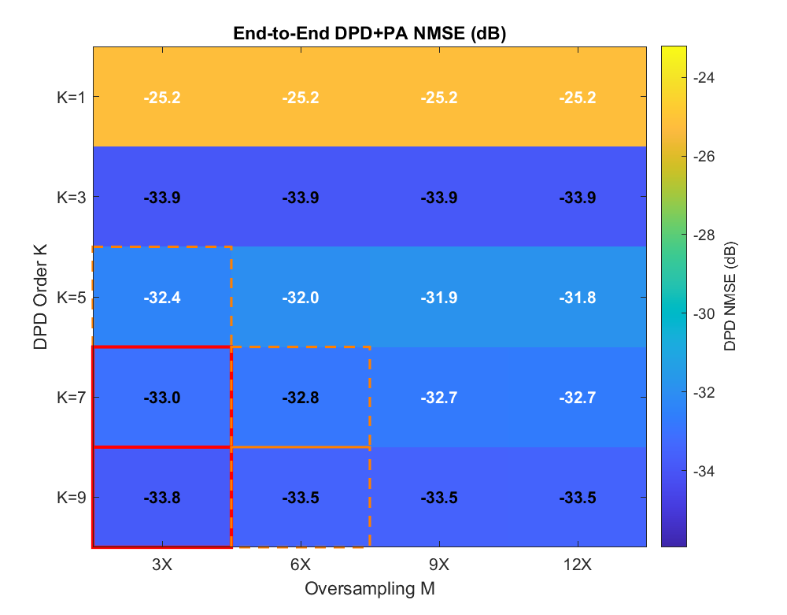
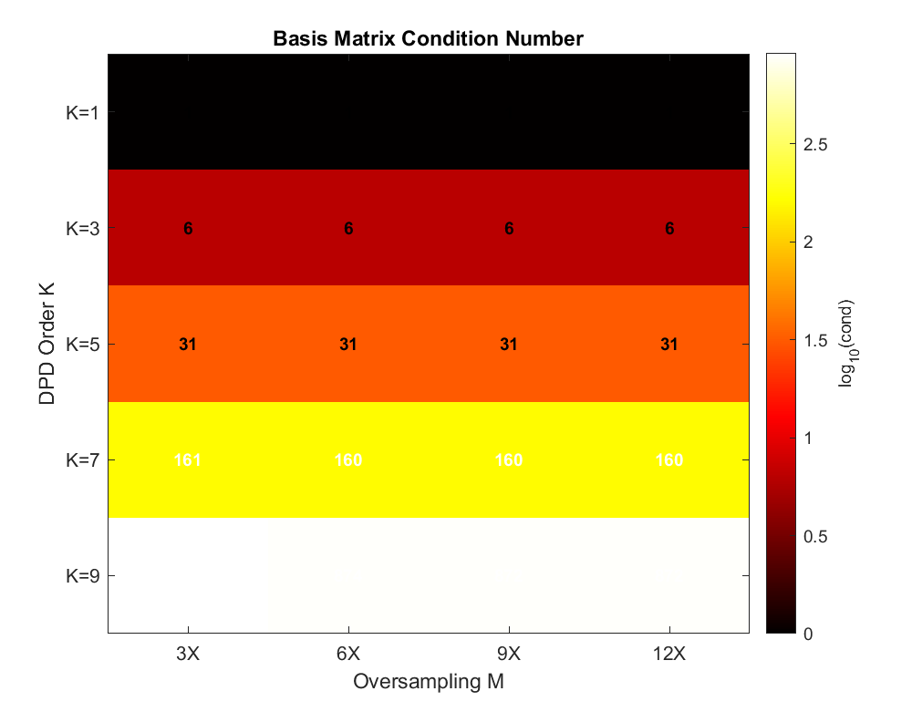

# DPD Polynomial Order vs Sampling Rate — 完整分析報告

**日期**: 2026-04-06
**Script**: `DPD_sampling_analysis.m`
**延伸自**: `PA_poly_regrowth.m`（per-order spectral regrowth 分析）

---

## 1. 研究問題

### 1.1 背景

**DPD**（Digital Pre-Distortion，數位預失真）是用來校正 **PA**（Power Amplifier，功率放大器）非線性失真的技術。DPD 在數位端產生一個「反向失真」的訊號，讓 PA 輸出盡可能接近線性。

DPD 最常用的 model 是 **odd-order polynomial**：

```math
z(n) = \sum_{k \in \{1,3,5,7,9\}} w_k \cdot x(n) \cdot |x(n)|^{k-1}
```

其中 $x(n)$ 是輸入訊號，$w_k$ 是 DPD 係數，$z(n)$ 是預失真後送進 PA 的訊號。

### 1.2 核心問題

每個 order $k$ 的 basis function $x \cdot |x|^{k-1}$ 產生的頻寬是 $k \times \text{BW}$（嚴格 hard cutoff，推導見 `PA_poly_regrowth_report.md` 第 3 節）。

如果 DPD 的取樣率 $F_s = M \times \text{BW}$，那 Nyquist 頻率是 $F_s / 2 = M \times \text{BW} / 2$。當 $k > M$ 時，basis 的頻寬超過 Nyquist，超出的部分會**折回**（alias）。

**問題**：這個 aliasing 對 DPD 校正效果的影響有多大？什麼條件下才會真正污染到 signal band？

---

## 2. 模型設定

### 2.1 輸入訊號

| 參數 | 值 | 說明 |
|---|---|---|
| BW | 20 MHz | 訊號頻寬（complex baseband） |
| 產生方式 | Random-phase IFFT | 頻域 $[-10, +10]$ MHz 放方形 mask + 隨機相位，IFFT |
| Peak | 1（normalized） | |
| **PAPR** | 8.97 dB | Peak-to-Average Power Ratio（峰均比） |
| $F_{s,\text{ref}}$ | 720 MHz (36X) | 參考取樣率，確保所有 $K \leq 9$ 都無 aliasing |
| $N_{\text{ref}}$ | 98304 | 可被 D = [12, 6, 4, 3] 整除 |

### 2.2 PA 模型

Memoryless polynomial（無記憶多項式），7 階：

```math
y = x \cdot \bigl(a_1 + a_3 |x|^2 + a_5 |x|^4 + a_7 |x|^6\bigr)
```

| 係數 | 值 | 物理意義 |
|---|---|---|
| $a_1$ | $1.0$ | 小訊號增益（linear gain） |
| $a_3$ | $-0.3 + 0.1j$ | 3 階 intermodulation + AM/PM |
| $a_5$ | $0.08 - 0.05j$ | 5 階非線性 |
| $a_7$ | $-0.02 + 0.01j$ | 7 階非線性（較弱） |

在 $|x| = 0.9$ 約 2 dB AM/AM 壓縮（gain compression）+ 3 度 AM/PM 相位偏移。

### 2.3 分析掃描參數

| 參數 | 值 |
|---|---|
| DPD orders $K$ | 1, 3, 5, 7, 9（僅 odd） |
| Oversampling $M = F_s / \text{BW}$ | 3, 6, 9, 12 |
| 對應 $F_s$ | 60, 120, 180, 240 MHz |
| DPD 訓練方式 | Iterative multiplicative correction, 20 iterations |
| 正規化 $\lambda$ | $10^{-6}$（Tikhonov regularization） |

---

## 3. 分析方法

### 3.1 Golden Reference 策略

在 $F_{s,\text{ref}} = 720$ MHz 計算所有 basis function。對 $K = 9$，basis bandwidth = $9 \times 20 = 180$ MHz，遠小於 Nyquist = 360 MHz，所以 reference 完全無 aliasing。

### 3.2 比較流程

對每個目標取樣率 $F_s = M \times \text{BW}$：

1. **Decimate**：從 720 MHz 的 master signal 取每第 $D$ 個 sample → 得到 $F_s$ 下的訊號
2. **計算 basis**：在 $F_s$ 計算 $y_k = x \cdot |x|^{k-1}$（當 $k > M$，頻譜超出 Nyquist 會自動 alias）
3. **Upsample**：用 `interpft` 把低速 basis 重建回 720 MHz（模擬 DAC 輸出）
4. **比較**：和 golden 算 **NMSE**（Normalized Mean Squared Error，歸一化均方誤差）：

```math
\text{NMSE} = 10 \log_{10} \frac{\sum |y_{k,\text{up}} - y_{k,\text{ref}}|^2}{\sum |y_{k,\text{ref}}|^2}
```

NMSE 越低越好。$< -100$ dB 代表完全一致（數值精度極限）。

---

## 4. Basis Function Aliasing 結果

### 4.1 Aliasing 的兩層條件

先區分兩種不同嚴重度的 aliasing：

**條件 1 — Total aliasing**（$K > M$）：basis 的頻寬 $K \times \text{BW}$ 超過 $F_s$，超出 Nyquist 的頻譜折回到 $[-F_s/2,\, F_s/2]$ 範圍內。

**條件 2 — In-band aliasing**（$K \geq 2M$）：折回的頻譜**剛好落在 signal band**（$\pm \text{BW}/2 = \pm 10$ MHz）。這比條件 1 更嚴格。

推導：頻率 $f_0$（介於 $F_s/2$ 到 $K \cdot \text{BW}/2$ 之間）折回到 $f_0 - F_s$。要落在 signal band 內：

```math
|f_0 - F_s| \leq \frac{\text{BW}}{2}
```

展開：

```math
F_s - \frac{\text{BW}}{2} \leq f_0 \leq F_s + \frac{\text{BW}}{2}
```

因為 $f_0$ 最大只到 $K \cdot \text{BW}/2$，所以需要這個範圍和 $[F_s/2,\, K \cdot \text{BW}/2]$ 有交集：

```math
\frac{K \cdot \text{BW}}{2} > F_s - \frac{\text{BW}}{2} = \frac{(2M - 1) \cdot \text{BW}}{2}
```

化簡得 $K > 2M - 1$，因為 $K$ 是整數，所以 **$K \geq 2M$**。

### 4.2 三層分類表

| | M=3 | M=6 | M=9 | M=12 |
|---|---|---|---|---|
| K=1 | OK | OK | OK | OK |
| K=3 | Edge | OK | OK | OK |
| K=5 | **OOB-only** | OK | OK | OK |
| K=7 | **IN-BAND** | OOB-only | OK | OK |
| K=9 | **IN-BAND** | OOB-only | Edge | OK |

- **OK** = 無 aliasing
- **Edge** = basis bandwidth 剛好等於 $F_s$，邊界值為零，不 alias
- **OOB-only** = aliasing 落在 adjacent channel（10-30 MHz），**不影響 signal band**
- **IN-BAND** = aliasing 落在 signal band（$\pm 10$ MHz），**直接污染訊號**

### 4.3 Total NMSE（全頻段 waveform error vs golden）

| | M=3 | M=6 | M=9 | M=12 |
|---|---|---|---|---|
| K=1 | 0 | 0 | 0 | 0 |
| K=3 | 0 | 0 | 0 | 0 |
| K=5 | **-24.2 dB** | 0 | 0 | 0 |
| K=7 | **-17.8 dB** | **-66.6 dB** | 0 | 0 |
| K=9 | **-14.3 dB** | **-50.6 dB** | 0 | 0 |

（0 = NMSE < -100 dB，代表和 golden 完全一致）

### 4.4 In-Band NMSE（僅 $\pm 10$ MHz 內的 error）

| | M=3 | M=6 | M=9 | M=12 |
|---|---|---|---|---|
| K=1 ~ K=5 | 0 | 0 | 0 | 0 |
| K=7 | **-45.4 dB** | 0 | 0 | 0 |
| K=9 | **-36.4 dB** | 0 | 0 | 0 |

**K=5 at M=3** 是最有趣的 case：total NMSE = -24.2 dB（有 aliasing），但 **in-band NMSE = 0**（signal band 完全沒被污染）。因為折回的頻譜剛好落在 adjacent channel（10-30 MHz），不是 signal band。





---

## 5. K=9 @ 3X Deep Dive

### 5.1 頻譜折回圖解

$K = 9$ 的 basis bandwidth = $9 \times 20 = 180$ MHz，頻譜範圍 $\pm 90$ MHz。
在 $F_s = 60$ MHz（$M=3$），Nyquist = 30 MHz。

超出 Nyquist 的每個 20 MHz 頻帶折回到不同位置：

| 原始頻帶 (MHz) | 折回到 (MHz) | 落在哪裡？ |
|---|---|---|
| [0, 10] | [0, 10] | Signal band（不動） |
| [10, 30] | [10, 30] | ACLR1（不動） |
| [30, 50] | [-30, -10] | ACLR1 負側（alias） |
| **[50, 70]** | **[-10, 10]** | **Signal band（IN-BAND alias!）** |
| [70, 90] | [10, 30] | ACLR1（alias） |

負頻率側對稱：**[-70, -50] MHz 也折到 [-10, 10] MHz**。

所以 in-band 被 [50, 70] 和 [-70, -50] MHz 兩段頻帶的能量污染，造成 in-band NMSE = -36.4 dB。

### 5.2 視覺化

左上圖用顏色標示每個頻帶的折回目的地（紅色 = 折到 in-band），右下圖比較 K=9 DPD 在 3X vs 12X 的輸出頻譜。



---

## 6. End-to-End DPD 效能

### 6.1 DPD 訓練方法

使用 **iterative multiplicative correction**（直接學習法）。原理：每次迭代算出「PA 輸出和理想輸出的比值」，然後修正 DPD 的預失真訊號，再重新擬合係數。重複 20 次直到收斂。預失真訊號的振幅上限設為 1.5（避免驅動 PA 到極端飽和區）。

### 6.2 DPD NMSE 結果

NMSE 衡量 DPD+PA 輸出和理想線性輸出的差距（越低代表線性化越好）：

| | M=3 | M=6 | M=9 | M=12 |
|---|---|---|---|---|
| K=1 | -25.2 | -25.2 | -25.2 | -25.2 |
| **K=3** | **-33.9** | **-33.9** | **-33.9** | **-33.9** |
| K=5 | -32.4 | -32.0 | -31.9 | -31.8 |
| K=7 | -33.0 | -32.8 | -32.7 | -32.7 |
| K=9 | -33.8 | -33.5 | -33.5 | -33.5 |



### 6.3 關鍵觀察

**DPD 效能在所有取樣率下幾乎完全相同**。即使 K=9 at M=3（有 in-band basis aliasing -36.4 dB），DPD NMSE 只差 0.3 dB（-33.8 vs -33.5）。

原因：DPD 的主要校正來自 $K=3$（見第 7 節），$K=3$ 的 bandwidth = 60 MHz，在 $M=3$ 剛好 fit Nyquist，所以 dominant correction 完全不受 aliasing 影響。

---

## 7. DPD 係數分析

### 7.1 係數大小

以 $K=9$ DPD 為例，各 order 的係數大小 $|w_k|$（dB = $20 \log_{10} |w_k|$）：

| Order $k$ | M=3 | M=12 |
|---|---|---|
| 1 | -0.3 | -0.3 |
| 3 | 0.6 | 1.2 |
| 5 | 13.4 | 14.3 |
| 7 | 20.7 | 21.5 |
| 9 | 16.5 | 17.2 |

$|w_k|$ 隨 order 增加而變大，但這**不代表高 order 的貢獻更大**。

### 7.2 為什麼高 order 的貢獻很小

Basis function $x \cdot |x|^{k-1}$ 的振幅隨 $k$ 急遽下降。舉例：若訊號 RMS $\approx 0.36$，那 $|x|^{k-1}$ 的 RMS：

- $k=1$: $|x|^0 = 1$
- $k=3$: $|x|^2 \approx 0.13$
- $k=5$: $|x|^4 \approx 0.017$
- $k=9$: $|x|^8 \approx 0.00028$

DPD 輸出中第 $k$ 階的實際貢獻 $\approx |w_k| \times \text{RMS}(x \cdot |x|^{k-1})$。即使 $|w_9|$ 有 16.5 dB（$\approx 6.7$ 倍），乘上 $0.00028$ 的 basis RMS 後，貢獻只有 $\approx 0.002$，遠小於 $k=1$ 的 $\approx 0.97$。

所以即使高 order basis 有嚴重的 aliasing，**乘上極小的 weighted contribution 後，影響可忽略**。


---

## 8. Observation Path Aliasing

在實際 DPD 系統中，PA 輸出會經由 **feedback ADC**（回授類比數位轉換器）取樣，以 $F_s$ 送回做 DPD 訓練。PA 的 output bandwidth 最大可到 $7 \times 20 = 140$ MHz（因為 PA 是 7 階）。如果 feedback ADC 只有 60 MHz（$M=3$），PA output 中 30-140 MHz 的非線性產物會 alias。

| M | $F_s$ (MHz) | Obs NMSE total | Obs NMSE in-band |
|---|---|---|---|
| 3 | 60 | -63.6 dB | -99.8 dB |
| 6 | 120 | -119.2 dB | < -300 dB |
| 9 | 180 | < -300 dB | < -300 dB |
| 12 | 240 | < -300 dB | < -300 dB |

$M=3$ 的 in-band observation aliasing 只有 -99.8 dB（因為 PA 的 7 階係數 $a_7 = -0.02 + 0.01j$ 很弱），可忽略。$M \geq 6$ 時 observation aliasing 完全消失。

---

## 9. Basis Matrix Condition Number

Condition number 反映 DPD 訓練時最小平方法（LS）的數值穩定性。越大代表 basis vectors 越接近線性相依，LS 求解越不穩定：

| | M=3 | M=6 | M=9 | M=12 |
|---|---|---|---|---|
| K=1 | 1.0 | 1.0 | 1.0 | 1.0 |
| K=3 | 6.4 | 6.4 | 6.4 | 6.4 |
| K=5 | 31 | 31 | 31 | 31 |
| K=7 | 161 | 160 | 160 | 160 |
| K=9 | 919 | 874 | 872 | 872 |

Condition number 主要取決於 basis function 的 dynamic range（$|x|^8$ 和 $|x|^0$ 的振幅比），**和取樣率幾乎無關**。K=9 的 cond $\approx 900$，加上 Tikhonov regularization（$\lambda = 10^{-6}$）後 LS 求解穩定。



---

## 10. 結論與設計建議

### 10.1 Aliasing 三層分類

| 條件 | 效應 | 對 DPD 的影響 |
|---|---|---|
| $K \leq M$ | 無 aliasing | 完全安全 |
| $M < K < 2M$ | OOB-only（折到 adjacent channel） | Signal band 不受影響 |
| $K \geq 2M$ | In-band aliasing（折到 signal band） | Basis waveform 被污染 |

### 10.2 實際影響比理論小

雖然 basis function 有 aliasing（K=9 at M=3 in-band NMSE = -36.4 dB），但 **DPD 整體效能幾乎不受影響**（NMSE 差 < 0.5 dB）。原因：

1. DPD 的 dominant correction 來自 $K=3$，它的 bandwidth = 60 MHz，在 $M=3$ 不 alias
2. 高 order（$K=5, 7, 9$）的 DPD 係數乘上 basis RMS 後，weighted 貢獻很小
3. DPD 訓練會自適應調整係數，部分補償 aliasing 的影響

### 10.3 設計建議

| 設計情境 | 建議最低 $M$ | 理由 |
|---|---|---|
| DPD $K \leq 9$，一般 PA | **$M \geq 3$** | 3X 的 DPD 效能和 12X 差 < 0.5 dB |
| 強非線性 PA（$a_5, a_7$ 大） | **$M \geq 6$** | 確保 in-band 零 aliasing |
| 需要 clean adjacent channel | **$M \geq K$** | 避免 OOB aliasing |
| 需要 clean observation path | **$M \geq 6$** | 對 7 階 PA |

### 10.4 K=9 @ 3X 具體結論

- Basis in-band NMSE = -36.4 dB（[50-70] MHz 折到 signal band）
- 但 DPD NMSE = -33.8 dB（vs M=12 的 -33.5 dB，差 0.3 dB）
- **3X 跑 K=9 DPD 是可行的**，前提是 PA 非線性不太強

---

## 附錄：Figure 列表

| 檔名 | 內容 |
|---|---|
| `DPD_sampling_PA_char.png` | PA AM/AM + AM/PM + gain compression |
| `DPD_sampling_spectra.png` | 5x4 spectral grid（golden vs aliased） |
| `DPD_sampling_NMSE.png` | Total NMSE heatmap |
| `DPD_sampling_NMSE_inband.png` | In-band NMSE heatmap |
| `DPD_sampling_ACLR.png` | ACLR heatmap（basis 過 PA） |
| `DPD_sampling_dpd_perf.png` | End-to-end DPD+PA NMSE heatmap |
| `DPD_sampling_coeff.png` | DPD 係數大小（K=9，不同 M 比較） |
| `DPD_sampling_cond.png` | Basis matrix condition number |
| `DPD_sampling_K9_fold.png` | K=9@3X 頻譜折回圖解 + DPD 比較 |
