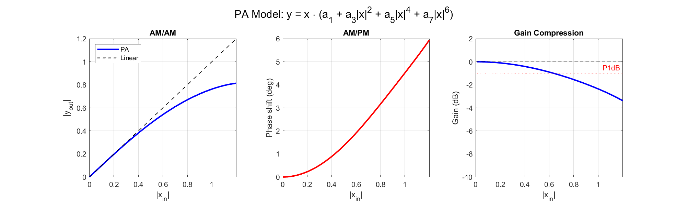

# DPD Polynomial Order vs Sampling Rate — Aliasing Analysis

DPD（數位預失真）的 polynomial basis function $x \cdot |x|^{k-1}$ 頻寬是 $k \times \text{BW}$。如果取樣率不夠高，高 order 的頻譜會折回（alias）。這個 repo 完整分析這個效應對 DPD 效能的影響。

## 摘要

分析 DPD polynomial order $K \in \{1, 3, 5, 7, 9\}$ 搭配取樣率 $F_s \in \{3, 6, 9, 12\} \times \text{BW}$ 的所有組合。

**三個關鍵發現**：

1. **Aliasing 有兩層**：$K > M$ 會造成 total aliasing，但**只有 $K \geq 2M$ 才會污染 signal band**。例如 K=5 在 3X 有 aliasing（total NMSE = -24 dB），但 signal band 完全沒被影響。

2. **DPD 效能幾乎不受影響**：即使 K=9 在 3X（有 in-band aliasing），end-to-end DPD NMSE 只差 0.3 dB。原因是高 order correction 的 weighted contribution 很小。

3. **6X 對 $K \leq 9$ 完全安全**：in-band aliasing 為零。3X 也可用，但 K=7/9 有 in-band aliasing（-45 / -36 dB）。

## PA 模型

Memoryless polynomial（7 階）：$y = x \cdot (1.0 + (-0.3{+}0.1j)|x|^2 + (0.08{-}0.05j)|x|^4 + (-0.02{+}0.01j)|x|^6)$



## Aliasing 條件表

|  | 3X | 6X | 9X | 12X |
|---|---|---|---|---|
| K=1 | OK | OK | OK | OK |
| K=3 | Edge | OK | OK | OK |
| K=5 | OOB-only | OK | OK | OK |
| K=7 | **IN-BAND** | OOB-only | OK | OK |
| K=9 | **IN-BAND** | OOB-only | Edge | OK |

## 主要結果

### Basis Function Aliasing（Total NMSE）


### End-to-End DPD Performance


### K=9 @ 3X Spectral Folding

[50-70] MHz 的頻譜折回到 signal band（$\pm 10$ MHz），造成 in-band NMSE = -36.4 dB。


## 檔案

| 檔案 | 說明 |
|---|---|
| [`DPD_sampling_analysis.m`](DPD_sampling_analysis.m) | MATLAB script（15 sections，~800 行） |
| [`DPD_sampling_report.md`](DPD_sampling_report.md) | 完整分析報告（10 章） |
| `DPD_sampling_*.png` | 9 張分析圖 |

## How to Run

MATLAB R2021a 或更新：

```matlab
cd path/to/dpd-sampling-analysis
DPD_sampling_analysis
```

約需 30 秒，產生 9 張 PNG + console 輸出。
